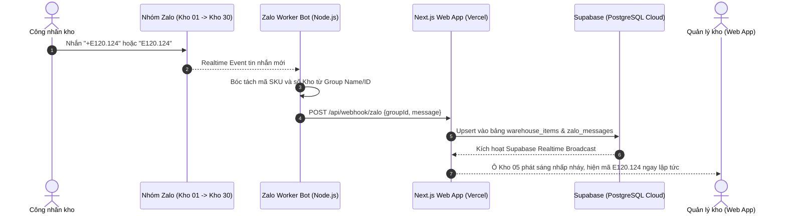

# KẾ HOẠCH CHI TIẾT: KẾT NỐI SUPABASE & TRUY XUẤT TỰ ĐỘNG TIN NHẮN TỪ 30 NHÓM ZALO LÊN VERCEL

---

## 1. MỤC TIÊU DỰ ÁN
1. **Lưu trữ dữ liệu vĩnh viễn trên Supabase (Cloud PostgreSQL)**: 
   - Thay thế việc ghi file `database.json` cục bộ để khi Web App deploy lên Vercel không bị mất dữ liệu hay lỗi quyền ghi.
   - Hỗ trợ tính năng **Realtime**: Khi có dữ liệu mới từ Zalo, màn hình Web tự động nhảy số mà không cần F5.
2. **Truy xuất tin nhắn tự động từ 30 nhóm Zalo**:
   - Xây dựng một Worker Bot độc lập (Node.js) sử dụng tài khoản Zalo phụ.
   - Quét QR đăng nhập 1 lần duy nhất, duy trì phiên nghe tin nhắn 24/7 từ 30 nhóm.
   - Tự động bắt đúng mã (VD: `E120.124`, `E80.345`, `P120.50`), map đúng số Kho từ tên nhóm và đẩy thẳng về API Webhook trên Vercel.

---

## 2. SƠ ĐỒ LUỒNG DỮ LIỆU TỔNG THỂ (ARCHITECTURE)

---

## 3. CHI TIẾT CÁC GIAI ĐOẠN TRIỂN KHAI

### GIAI ĐOẠN 1: THIẾT KẾ CƠ SỞ DỮ LIỆU & TÍCH HỢP SUPABASE
- **Thời gian dự kiến**: 1 buổi làm việc.
- **Nội dung công việc**:
  1. Cung cấp file migration SQL chuẩn để khởi tạo cấu trúc bảng trên Supabase:
     - Bảng `warehouse_items`: Lưu danh sách mã SKU độc bản, vị trí kho (1 - 30), thời gian nhập (`updated_at`).
     - Bảng `zalo_messages`: Lưu nhật ký tin nhắn thô, trạng thái bóc tách (thành công/lỗi).
  2. Bật chế độ `supabase_realtime` cho cả 2 bảng.
  3. Cài đặt thư viện `@supabase/supabase-js` vào dự án Next.js.
  4. Cập nhật module `src/lib/store.ts` chuyển từ đọc/ghi file `data/database.json` sang gọi trực tiếp qua Supabase Client:
     - Có cơ chế Fallback an toàn (nếu chưa điền Key Supabase thì tạm dùng local để không bị crash).
  5. Cập nhật trang chính `src/app/page.tsx` lắng nghe sự kiện Realtime qua WebSocket của Supabase để tự động render lại giao diện khi có mã mới.

---

### GIAI ĐOẠN 2: XÂY DỰNG WORKER BOT TRUY XUẤT TIN NHẮN TỪ 30 NHÓM ZALO
- **Thời gian dự kiến**: 1 - 2 buổi làm việc.
- **Nội dung công việc**:
  1. Xây dựng dịch vụ `zalo-bot/` độc lập (sử dụng thư viện `zca-js` chuyên biệt cho giao thức Zalo):
     - **Cơ chế xác thực**: Đăng nhập bằng cách quét mã QR code xuất trực tiếp trên màn hình terminal lần đầu, sau đó lưu cookie/session để tự động đăng nhập lại các lần sau mà không cần quét lại.
  2. **Bảng ánh xạ 30 Nhóm Zalo (Mapping Config)**:
     - File cấu hình `zalo-mapping.json` tự động map Group ID của Zalo với số kho từ 1 đến 30 (ví dụ nhóm tên *"KHO 05"* hoặc *"Kho 5"* tự động map thành `warehouse = 5`).
  3. **Module lọc & chuẩn hóa tin nhắn**:
     - Bỏ qua các tin nhắn tán gẫu, hình ảnh linh tinh không chứa mã hàng.
     - Nhận diện các cú pháp:
       - `E120.124` hoặc `+E120.124` hoặc `NK E120.124`: Báo nhập kho.
       - `-E120.124` hoặc `XK E120.124`: Báo xuất kho.
  4. **Module chuyển tiếp API (Forwarder)**:
     - Gửi HTTP POST request đến endpoint `https://<ten-du-an>.vercel.app/api/webhook/zalo`.
     - Tự động thử lại (Retry) nếu mạng chập chờn.

---

### GIAI ĐOẠN 3: ĐÓNG GÓI & DEPLOY LÊN VERCEL
- **Thời gian dự kiến**: 1 buổi làm việc.
- **Nội dung công việc**:
  1. Kiểm tra build production Next.js sạch sẽ (loại bỏ toàn bộ cảnh báo lint/types).
  2. Hướng dẫn thiết lập 2 biến môi trường quan trọng trên Vercel:
     - `NEXT_PUBLIC_SUPABASE_URL`
     - `NEXT_PUBLIC_SUPABASE_ANON_KEY`
  3. Deploy bản hoàn thiện lên Vercel để lấy link chính thức hoạt động 24/7.
  4. Hướng dẫn nơi treo Worker Bot Zalo:
     - Có thể chạy nền ngay trên máy tính văn phòng/kho (bật khi kho làm việc).
     - Hoặc đưa lên máy chủ ảo VPS giá rẻ (như Render/Railway/VPS cá nhân) để chạy 24/7.

---

### GIAI ĐOẠN 4: TEST THỰC TẾ & BÀN GIAO QUY TRÌNH
- **Nội dung công việc**:
  1. Thử nghiệm thực tế: Dùng nick nhân viên nhắn thử 1 mã vào nhóm Zalo thật.
  2. Kiểm tra xem trên Web App Vercel (mở trên điện thoại) có nhảy vị trí ô kho tương ứng ngay lập tức không.
  3. Bàn giao tài liệu hướng dẫn vận hành cho nhân viên kho.

---

## 4. BẢNG TỔNG HỢP CÁC BƯỚC TRIỂN KHAI THEO THỨ TỰ DUYỆT

| Bước | Hạng mục công việc | Bạn cần chuẩn bị | Sản phẩm bàn giao |
| :---: | :--- | :--- | :--- |
| **B1** | Tạo dự án Supabase & chạy lệnh SQL | 1 tài khoản Supabase (free) | Script SQL tạo bảng sẵn |
| **B2** | Viết code kết nối Supabase vào Web App Next.js | Cung cấp URL & Anon Key Supabase | Code Next.js đã chuyển đổi xong |
| **B3** | Viết mã nguồn Zalo Worker Bot quét QR | 1 số Zalo phụ làm Bot kho | Thư mục `zalo-bot` chạy quét QR ngay |
| **B4** | Deploy Web App lên Vercel | Tài khoản Vercel | Đường link Web chạy chính thức |
| **B5** | Test đồng bộ thực tế từ Zalo lên Web | Nhắn thử mã vào nhóm | Hệ thống vận hành hoàn chỉnh |

---

Bạn xem qua bản kế hoạch chi tiết này, nếu thấy chuẩn và duyệt phương án thì chỉ cần phản hồi **"Duyệt"**, tôi sẽ bắt tay vào làm ngay **Bước 1 & Bước 2 (Cung cấp script Supabase và code kết nối)** trước nhé!
